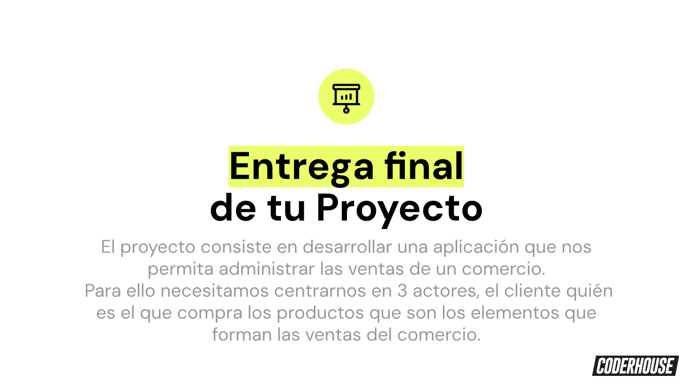
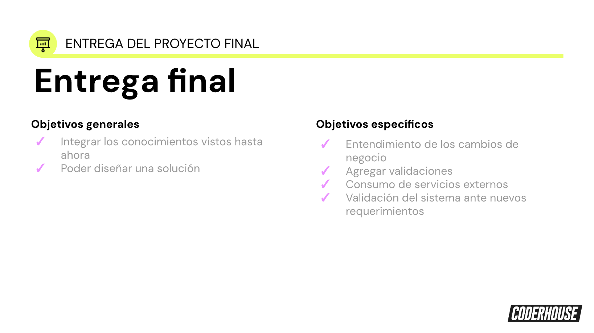
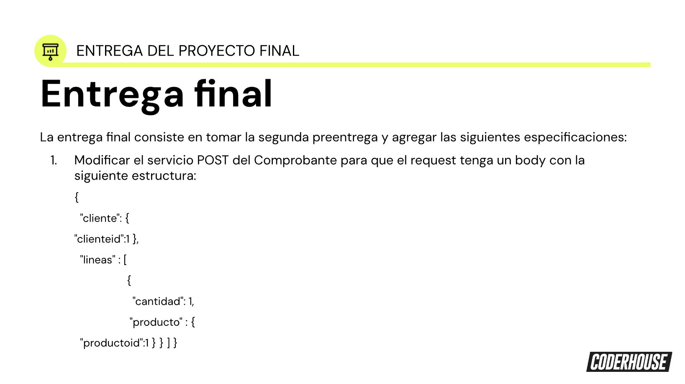
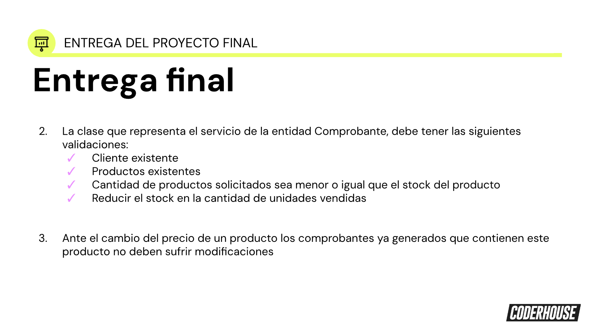
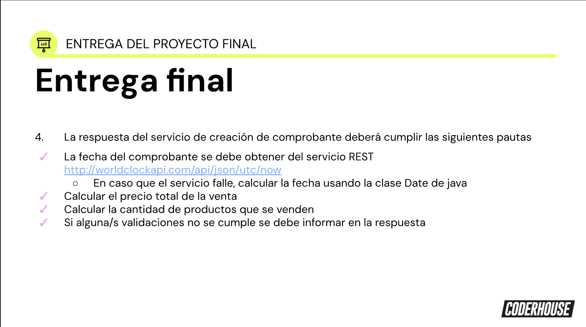
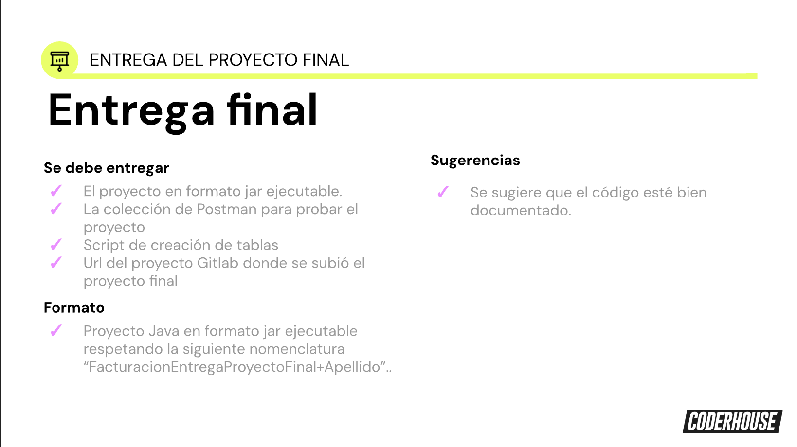

<p align="center"> 
    
</p>

# Bienvenidos a la Comisión #53330

<br><p align="center">
</p>

<p align="center"> 
 <a href="https://www.w3.org/html/" target="_blank"> 
     </a> 
    &nbsp &nbsp
 <a href="https://www.w3schools.com/css/" target="_blank"> 
 </a> 
</p>

---

## Entrega Final:

### El Proyecto Integrador debe incluir todos los temas vistos en el Curso:

<p align="center"> 
 
  
   
    
     
      

</p>


----

## Tips Importantes:

Exploraremos conceptos fundamentales en Java que son esenciales para comprender y escribir programas efectivos. Estos conceptos son básicos pero críticos para cualquier estudiante de Java, ya que forman la base sobre la cual se construyen programas más complejos y sofisticados. Los términos que abordaremos incluyen public, static, void, private y más. Comencemos desglosando cada uno de estos términos.

1. public
public es un modificador de acceso que se aplica a clases, métodos y variables. Cuando un miembro de una clase se declara como public, está disponible para su acceso desde cualquier otra clase. Es decir, se puede acceder a él desde fuera de la clase donde está definido.

Ejemplo:
```
public class MiClase {
    public int miVariablePublica;
    public void miMetodoPublico() {
        // Código del método
    }
}
```

2. private
private es otro modificador de acceso. Cuando un miembro de una clase se declara como private, solo es accesible dentro de la misma clase. Esto significa que otros objetos o clases no pueden acceder directamente a este miembro.

Ejemplo:
```
public class MiClase {
    private int miVariablePrivada;
    private void miMetodoPrivado() {
        // Código del método
    }
}
```

3. static
static es una palabra clave utilizada para crear campos o métodos que pertenecen a la clase en sí, en lugar de pertenecer a instancias individuales de la clase. Los miembros static se pueden acceder sin la necesidad de crear una instancia de la clase.

Ejemplo:
```
public class MiClase {
    public static int miVariableEstatica;
    public static void miMetodoEstatico() {
        // Código del método
    }
}
```

4. void
void es una palabra clave utilizada para indicar que un método no devuelve ningún valor. Cuando un método tiene un tipo de retorno void, significa que el método realiza ciertas acciones pero no devuelve ningún valor al llamador.

Ejemplo:
```
public class MiClase {
    public void metodoQueNoDevuelveNada() {
        // Código del método
    }
}
```

5. main
main es el punto de entrada para la ejecución de un programa Java. Es el método que se ejecuta cuando se inicia un programa Java y su firma debe ser exactamente como sigue:


```
public static void main(String[] args)
```
Aquí, public indica que el método es accesible desde cualquier otra clase, static indica que el método pertenece a la clase en sí y no a instancias individuales de la clase, void indica que el método no devuelve ningún valor y String[] args es un parámetro que permite pasar argumentos al programa.

Estos conceptos son fundamentales en Java y proporcionan la base para comprender cómo se estructuran y comportan los programas en este lenguaje de programación. Dominar estos conceptos es esencial para cualquier estudiante de Java que desee escribir programas eficientes y bien estructurados.

6. class
class es una palabra clave utilizada para definir una nueva clase en Java. Una clase es un plano, una plantilla o un molde a partir del cual se pueden crear objetos. Define las propiedades (campos) y comportamientos (métodos) comunes a todos los objetos de ese tipo.

Ejemplo:
```
public class MiClase {
    // Campos y métodos de la clase
}
```

7. new
new es una palabra clave utilizada para crear una nueva instancia de una clase. Reserva memoria para el nuevo objeto y llama al constructor de la clase para inicializarlo.

Ejemplo:
```
MiClase objeto = new MiClase();
```

8. return
return es una palabra clave utilizada dentro de un método para devolver un valor al código que llamó al método. Marca el final del método y puede devolver un valor del tipo especificado en la firma del método, si corresponde.

Ejemplo:
```
public int sumar(int a, int b) {
    return a + b;
}
```

9. this
this es una palabra clave que se refiere a la instancia actual de la clase. Se utiliza para diferenciar entre los campos de la clase y los parámetros de los métodos o constructores cuando tienen el mismo nombre.

Ejemplo:
```
public class Persona {
    private String nombre;
    
    public Persona(String nombre) {
        this.nombre = nombre;
    }
}
```

10. final
final es una palabra clave que se puede aplicar a una clase, método o variable. Cuando se aplica a una clase, indica que la clase no puede ser subclaseada. Cuando se aplica a un método, indica que el método no puede ser sobrescrito. Cuando se aplica a una variable, indica que su valor no puede cambiar después de la inicialización.

Ejemplo:
```
public final class MiClaseFinal {
    // Contenido de la clase
}

public class OtraClase {
    public final void metodoFinal() {
        // Código del método
    }
}

public class Ejemplo {
    public final int VALOR = 10;
}
```

11. protected
El modificador protected permite el acceso al miembro al que se aplica desde otras clases en el mismo paquete y también desde subclases, independientemente de si están en el mismo paquete o no.

Ejemplo:
```
public class MiClase {
    protected int miVariableProtegida;
    protected void miMetodoProtegido() {
        // Código del método
    }
}
```

12. default (o sin modificador)
Si no se especifica ningún modificador (también conocido como "modificador de paquete"), el miembro es accesible solo dentro del mismo paquete. Esto significa que cualquier clase dentro del mismo paquete puede acceder al miembro, pero las clases fuera del paquete no pueden.

Ejemplo:

```
class MiClase {
    int miVariableDePaquete;
    void miMetodoDePaquete() {
        // Código del método
    }
}
```

## Profesor: Alejandro Daniel Di Stefano
